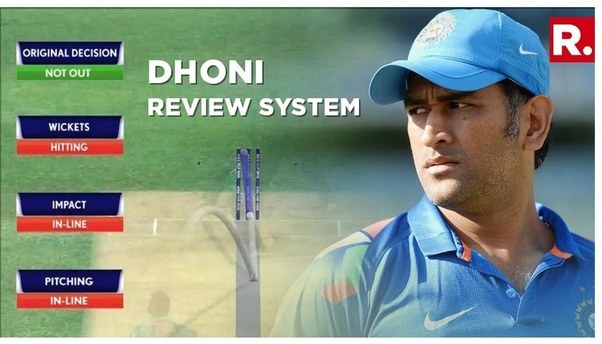

# Decision Review System (DRS) Simulator ✨

A Python application that simulates the cricket Decision Review System (DRS), transforming your desktop into a third umpire's toolkit. Review contentious calls, analyze plays in slow-motion, and make the final decision. Built with Tkinter and OpenCV.



## Features 🚀

-   **Interactive GUI:** A user-friendly interface built with Tkinter to manage the entire review process.
-   **Multi-Angle Replay:** Switch between different camera angles to get the best view of the action.
-   **Variable Speed Playback:** Analyze key moments with slow-motion and fast-motion replay controls.
-   **Decision Simulation:** Displays "Pending", "Out", or "Not Out" screens to mimic a real broadcast experience.
-   **LBW Stump Impact Prediction:** Manually select the stump area and let the application auto-detect the ball's trajectory to predict if it would have hit the wickets.
-   **Educational Tool:** An excellent way for cricket enthusiasts to understand the intricacies of the DRS process.

| Button                | Action                                                         |
| :-------------------- | :------------------------------------------------------------- |
| **< Previous / Next >** | Navigate through the video frame-by-frame at slow or fast speeds. |
| **Change Angle** | Switch to a different camera view of the play.                 |
| **Auto-Detect Impact** | Initiates the LBW decision process where you select the stumps.|
| **Give Out** | Manually declare the batsman as "Out".                         |
| **Give Not Out** | Manually declare the batsman as "Not Out".  

## 🛠️ Tech Stack

* **Core Language:** Python
* **GUI:** Tkinter
* **Video Processing:** OpenCV
* **Image Handling:** Pillow (PIL)
* **Video Stream Utilities:** imutils                   |

## Project Structure 📂

The project is organized into a main application file and an assets folder for media.

```
Decision-Review-System-DRS/
├── assets/
│   ├── 1.mp4
├   ├── ...
├   ├── 12.mp4
│   ├── dhoni.png
│   ├── not_out.png
│   ├── out.png
│   └── pending.png
├── main.py
├── requirements.txt
└── README.md

```

## Installation ⚙️

1.  **Clone the repository:**
    ```bash
    git clone https://github.com/Rudragupta23/decision-review-system-drs.git
    cd decision-review-system-drs
    ```

2.  **Create and activate a virtual environment (recommended):**
    ```bash
    # For Windows
    python -m venv venv
    .\venv\Scripts\activate

    # For macOS/Linux
    python3 -m venv venv
    source venv/bin/activate
    ```

3.  **Install the required packages:**
    ```bash
    pip install -r requirements.txt
    ```

## Usage ▶️

To run the application, execute the `main.py` script from the root directory of the project:

```bash
python main.py
